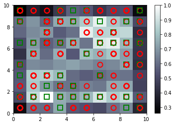

# Credit Card Fraud Detection

It predicts the number of people who have commited Credit card fraud. It uses the Self-Organising Map Algorithm to help the prediction.

A self-organizing map (SOM) or self-organizing feature map (SOFM) is an unsupervised machine learning technique used to produce a low-dimensional (typically two-dimensional) representation of a higher dimensional data set while preserving the topological structure of the data. For example, a data set with p variables measured in n observations could be represented as clusters of observations with similar values for the variables. These clusters then could be visualized as a two-dimensional "map" such that observations in proximal clusters have more similar values than observations in distal clusters. This can make high-dimensional data easier to visualize and analyze.

## Results

  

  
